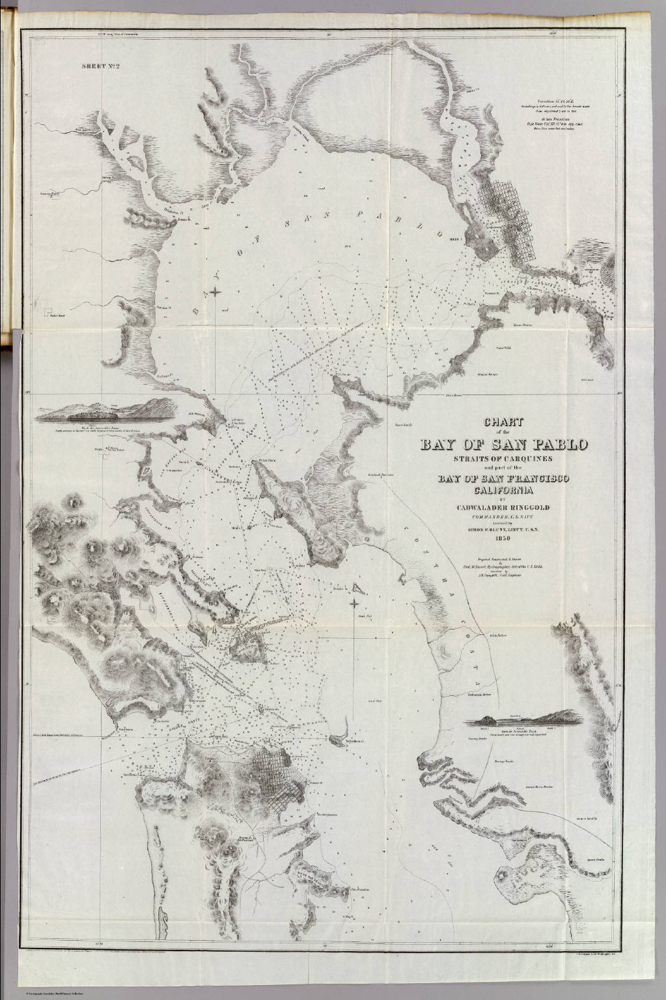

# Measuring the California Coast
{: .no_toc }

1. TOC
{:toc}

---

## Introduction

In 1807, President Thomas Jefferson created the Survey of the Coast, an agency dedicated to mapping coastlines at high levels of precision with the primary goal of making coastal waters safe for trade. Maps created near the end of the 18th century accurately described the contours of the Atlantic and Pacific coasts but many were not precise enough to guide sailors around hazards like rocks, sandbars, and shoals. Compounding this problem, in the West, there were no lighthouses to aid navigators sailing in particularly treacherous waters and foggy conditions. Construction and maintenance of lighthouses had come under the purview of the Treasury Department with the formation of the federal government in 1776 and were generally neglected until the mid-1800’s. The first west coast lighthouse was constructed in San Francisco Bay on Alcatraz Island in 1854 to mitigate against maritime accidents in the bustling gold-rush era harbor. 

The Survey of the Coast was tasked with both creating navigational charts and identifying locations for the placement of lighthouses. The development of suitable maps required innumerable skilled person-hours and use of bulky and often delicate precision instruments in inhospitable, even hazardous conditions. This collection combines instruments with cartographic examples to illustrate the challenges overcome by early surveyors of the California coast and to demystify the technical process of making these significant and beautiful maps.  

## The wild Pacific Coast 

* In the late 1700s, global resources and attention were focused on the American Revolution unfolding on the Atlantic Coast.    
* Misrepresentation of [California as an Island](https://exhibits.stanford.edu/california-as-an-island) lingered in some copies of copies of copies of European maps.  *[View related lesson plan](https://davidrumseymapcenter.github.io/california-as-an-island/)*
* Though fully traversed by European expeditions, the coast was still poorly understood, with the [first map of the San Francisco Bay](https://searchworks.stanford.edu/view/10773850) only published by the Portola Expedition in 1770\. Nearly 30 years then passed before Vancouver published his completed map of the northwest (shown below), which dispelled the idea of a passage connecting the Atlantic with the Pacific. *[View related lesson plan](https://davidrumseymapcenter.github.io/the-northwest-passage/)*

|  |  |
| ----- | ----- |
| 1798, Vancouver, *"Voyage of discovery to the North Pacific Ocean and round the world; in which the coast of north-west America has been carefully examined and accurately surveyed ... Atlas." \[cartographic material\].*  [View in Searchworks](https://searchworks.stanford.edu/view/10453623) • [View on DavidRumsey.com](https://www.davidrumsey.com/luna/servlet/s/znr8uv)  | 1799, Jean-Francois de Galaup, comte de La Perouse, *“Plan of the Port of St. Francisco in California.”* [View in Searchworks](https://searchworks.stanford.edu/view/10451027) • [View on DavidRumsey.com](https://www.davidrumsey.com/luna/servlet/s/wz2fov)  |

## Early days of scientific mapping 
* In the first half of the 19th century, ship's pilots and mapmakers alike sought to improve upon existing navigational charts of the western coast of North America.
* Coastal conditions made sailing and taking accurate measurements difficult. 
* Charts contained sparse and unreliable measurements, and pilots relied heavily on written guides and drawings of coastal landforms called "headlands" to orient themselves to the coastline.   

1825 Vandermaelen, Philippe, “*Nouvelle Californie*”  
Separate sheet [View in Searchworks](https://searchworks.stanford.edu/view/11878134) • [View on DavidRumsey.com](https://www.davidrumsey.com/luna/servlet/s/p1rg64)

Also found in series of atlases: [View in Searchworks](https://searchworks.stanford.edu/view/10453625) 

* Early map of the coast around San Francisco Bay 
* Note the crude depiction of the shape of the bay, sparse and scattered measurements, and sketchy topography
* Locations of hazardous rocks are indicated with tiny x's near Monterey and Bodega Point

1833 London: Hydrographical Office of the Admiralty, “*The Harbour of San Francisco, Nueva California. The Entrance to San Francisco Harbour. By Captn. F.W. Beechy ... 1827 & 8.”*  
[View in Searchworks](https://searchworks.stanford.edu/view/11878613) • [View on DavidRumsey.com](https://www.davidrumsey.com/luna/servlet/s/hydwc4)

* First scientific / well-measured mapping of the bay
* Features soundings, topography, and views of headlands and specific rock hazards
* Compare this with Vandermaelen's map published less than 10 years earlier  

## Gold Rush fever -- and bad maps! -- sink ships

* The discovery of gold in California in 1849 dramatically increased numbers of ships and travellers sailing up the west coast
* The 1846 Oregon Treaty was also a factor, in which the United States gained control over territory including present-day Oregon and Washington states
* Existing maps were insufficient for avoiding maritime hazards    
* Between 1849 and 1861, 24 shipwrecks are known to have happened just outside the entrance to the San Francisco Bay  
* Lighthouses were desperately needed along the entire coast, requiring assessment for ideal locations  
* Coast Survey was dispatched to make maps and find locations for lighthouses

**Significant related events**

- 1848 Congress authorized first west coast survey: Columbia River to Monterey  
- 1849 Gold discovered in CA → some survey crew members mutinied to go to gold fields   
- 1850 CA statehood  
- 1854 First west coast lighthouse constructed on Alcatraz in San Francisco Bay    
- 1861-65 Coast Survey members called back east due Civil War  
- 1867 George Davidson named head of the Coast Survey of the Pacific after a decade surveying both coasts 

1849 Imray, James. “*Chart of the North Pacific Ocean, …”*  

[View in Searchworks](https://searchworks.stanford.edu/view/11523249) • [View on DavidRumsey.com](https://www.davidrumsey.com/luna/servlet/s/5bpzw5)

* Compare soundings and coastal representation with earlier maps
* Map was used aboard the 
* Canvas container used to store and transport 

---

Alternates / additions:   

1851, Ringgold, Cadwalader. “General Chart, Embracing Surveys of the Bays of San Francisco and San Pablo.”

[View on DavidRumsey.com](https://www.davidrumsey.com/luna/servlet/s/w9bo86)   

 
1851, Ringgold, Cadwalader. “San Pablo Bay, Carquines Straits.”  
[View on DavidRumsey.com](https://www.davidrumsey.com/luna/servlet/s/q8an8e)

---

1854 Bache, AD, *“Maps and Charts of the United States Coast Survey. A.D. Bache, Superintendent”*  [View in Searchworks](https://searchworks.stanford.edu/view/10453301) 

[View on DavidRumsey.com](https://www.davidrumsey.com/luna/servlet/s/y3519i)

*(there are multiple relevant pages in this atlas)*

* Shows continued importance of headlands imagery for navigation  
* Sparse soundings; some indications of triangulation

## Mapping with precision instruments

### Measuring ocean depths

Hydrography, the measurement of the depths and hazards on sea floor, had been practiced for hundreds of years prior to the gold rush and depth measurements, called “soundings,” can be observed on some of the older maps in this collection. In the nineteenth century surveyors continued to capture measurements in the traditional way, using a sounding lead. What distinguishes the maps made during this period from those in use previously is the increased accuracy of the ***locations*** of the measurements.  

One method for ascertaining location involved the use of a sextant to measure the angle of the sun above the horizon. To take this measurement one must be able to see the horizon (or know where it is), a difficult prospect on a moving vessel at sea in an area characterized by dense intermittent coastal fog. Technological solutions were born to address the problem of surveyors being unable to perceive the horizon. These took several different forms. (artificial horizon, spirit-level horizon, bubble horizon). Artificial horizons were also used on land to establish the coordinates of a location when the horizon was obscured by trees, terrain, smoke, or fog. 

* George Davison’s modified sextant with spirit-level horizon 1867   
  [View on DavidRumsey.com](https://www.davidrumsey.com/luna/servlet/view/search?q=pub_list_no%3d%2216641.000%22&mi=0&qvq=sort:Pub_List_No_InitialSort%2CPub_Date%2CPub_List_No%2CSeries_No;lc:RUMSEY~8~1)

|  |  |
| :---: | :---: |
| [Black Glass Artificial Horizon](https://searchworks.stanford.edu/view/11894775) | [Davis Instruments Artificial Horizon](https://www.davisinstruments.com/products/artificial-horizon?srsltid=AfmBOooT5Xn-S5-wnIXkvkJwiE8PQbQhasgbbhYAobS9rPO3dqssC2ug) (on order) |

### Coastal hydrography

Teams working in small boats moving along the coast found precise sounding locations by using a pair of sextants turned horizontally (on their sides) to measure the angles between locations on shore: one shared center point, or station, and additional stations located to the right and left. A three-arm protractor (or “station pointer”) was used to plot these angles onto the sketch map, and a depth measurement from the sounding lead was recorded at the boat’s calculated location found at the center of the protractor.

![][image4]![][image5]  
Morrison, Taylor “The Coastal Mappers” [View in Searchworks](https://searchworks.stanford.edu/view/10179705) 

 **Tools needed for coastal hydrography:**

* Drawing board and [drawing tool set](https://searchworks.stanford.edu/view/11892834)  
* [Sounding lead](https://searchworks.stanford.edu/view/in00000128841) to measure depth  
* Two sextants to locate position of the ship (without artificial horizon attachments)  
* 3-arm protractor (or [station pointer](https://drive.google.com/file/d/1HvdQWU-_sfgg37cI4K9146DjbxKyu4kG/view?usp=drive_link)) to record on paper [View at Royal Museums Greenwich](https://www.rmg.co.uk/collections/objects/rmgc-object-42845)

 [Pocket drawing instrument set](https://searchworks.stanford.edu/view/11892834) c. 1790  
 
Sounding lead and line c.1900: [View in Searchworks](https://searchworks.stanford.edu/view/in00000128841)

### Describing terrain or topography

**Tools needed to complete a traverse, or topographical sketch:**

* [Plane table](https://searchworks.stanford.edu/view/11892835)  
* [Drawing tool set](https://searchworks.stanford.edu/view/11892834)  
* [Compass](https://searchworks.stanford.edu/view/11892860) to keep the paper oriented to the north  
* Stadia rod held by the rod man  
* [Alidade](https://searchworks.stanford.edu/view/11893423) / [Wye level](https://docs.google.com/presentation/d/1dJOeV_tx-2cC3YkGN4THWUZ5dXoHUNn288sOdm6QbgM/edit?slide=id.g3e1561f5d68_4_89#slide=id.g3e1561f5d68_4_89)?

| ![][image8] | ![][image9] |
| ----- | ----- |
| [Dietzgen plane table board](https://searchworks.stanford.edu/view/11892835) | [Lietz Alidade Ruler](https://searchworks.stanford.edu/view/11893423) |
| ![][image10] | ![][image11] |
| [12” Tamaya Wye level](https://docs.google.com/presentation/d/1dJOeV_tx-2cC3YkGN4THWUZ5dXoHUNn288sOdm6QbgM/edit?slide=id.g3e1561f5d68_4_89#slide=id.g3e1561f5d68_4_89)  Uncataloged Takeo Shikamura collection | [Stanley London Surveyor’s Prismatic Solar Compass](https://searchworks.stanford.edu/view/11892860) |

### Calculating distances with triangulation

**Tools needed for triangulation**

* Baseline (extremely exact, very long – 2 mi? – set of poles)  
* Theodolites (1 at each end)  
* Stations (location markers) as points in the web of triangles  
* Signal poles or small towers with flags 

## Elegant utilitarian cartography

While the primary mission was improving safety of maritime traffic, surveyors’ and cartographers’ close attention to settlements – down to depictions of the footprints of individual buildings – suggests interest on the part of the federal government beyond that of just maintaining navigable waters. High quality and extraordinary detail make these maps invaluable for contemporary study of the historical ecology of the California coastline and urbanization of the west. Davidson’s work was held in high esteem; “the records of the computing division showed that the results of his observations stood higher than any ever executed in America, Europe, or India, and they were characterized as "unique in the history of geodesy"” He retired in 1895 and went on to teach geography at UC Berkeley.  
![][image12]  
1859, United States Coast Survey, *“City Of San Francisco And Its Vicinity, California.”*  
[View in Searchworks](https://searchworks.stanford.edu/view/10453321) 

* *Gem and Stairway map*

![][image13]  
1863, British Admiralty, *“San Francisco Harbour Surveyed by Lieut. James Alden U.S. Navy 1856”* [View in Searchworks](https://searchworks.stanford.edu/view/11523237) 

* Soundings, buoys, instructions for entering the harbor  
* Compare with 1833 British map and 1799 French map

![][image14]

1878, United States Coast Survey, *“Tomales Bay California. From a Trigonometrical Survey under the direction of A.D. Bache Superintendent of the Survey Of The Coast Of The United States. Triangulation by G.A. Fairfield and G. Davidson Assts. Coast Survey.”* [View in Searchworks](https://purl.stanford.edu/kj039vw8000) 

* Triangulation by George Davidson  
* Shows separate parties for ***triangulation, topography, and hydrography***  
* Davidson’s personal copy: Hand-annotated by him, with notes about 1906 earthquake

![][image15]

1884, US Coast Survey, *“San Francisco Entrance, California”* [View on DavidRumsey.com](https://www.davidrumsey.com/luna/servlet/detail/RUMSEY~8~1~239951~5512086) 

* Improved precision – compare details with earlier maps of SF bay  
* Astronomical observations by Davidson  
* Lighthouses, buoys, and beacons aplenty  
* Urbanization and development, railroads, Oakland Mole
  
