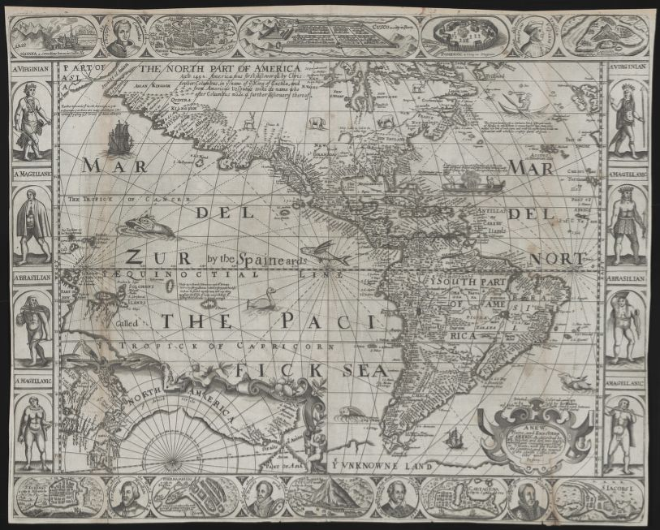
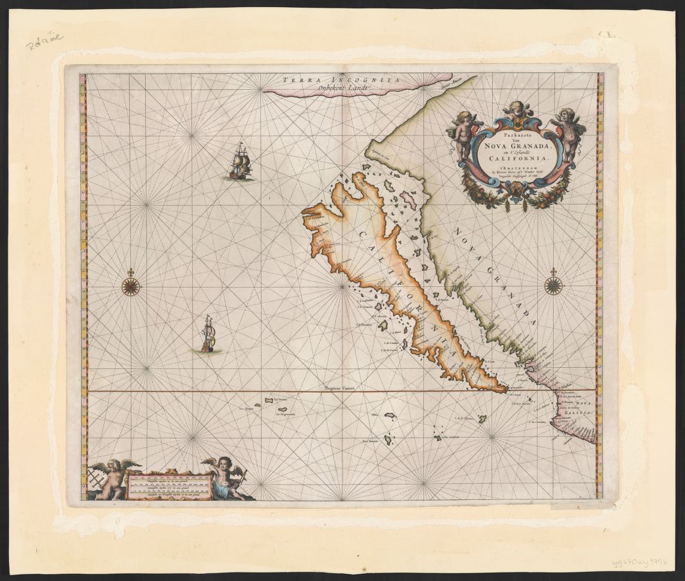
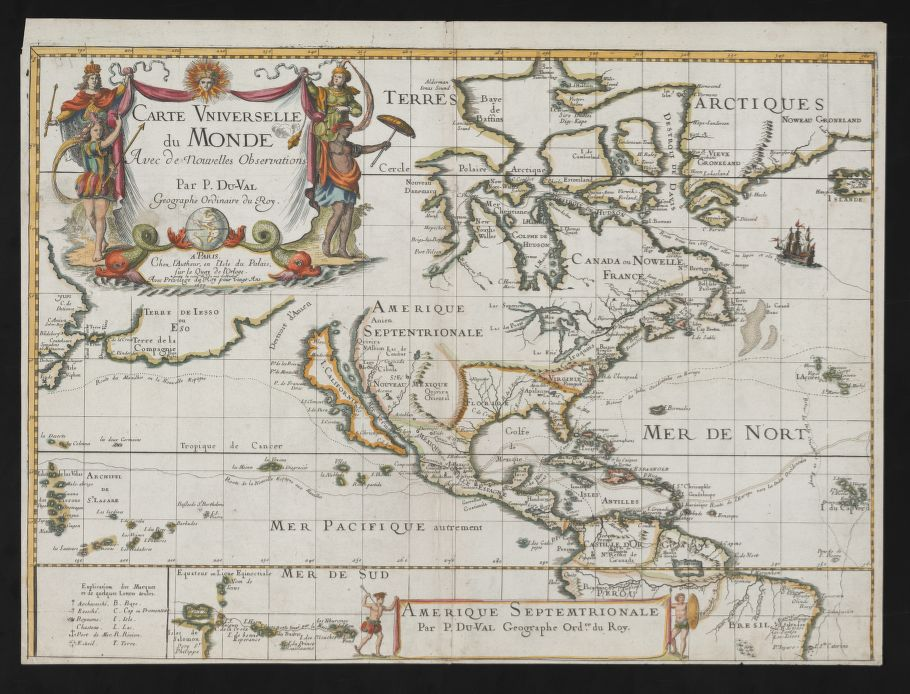
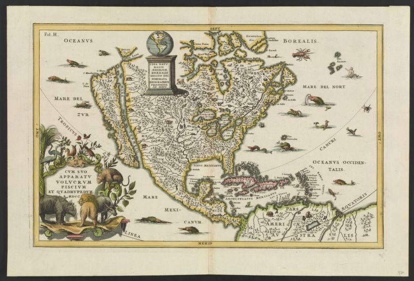
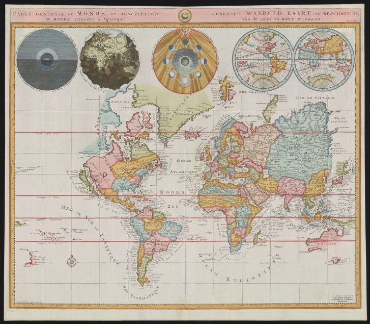
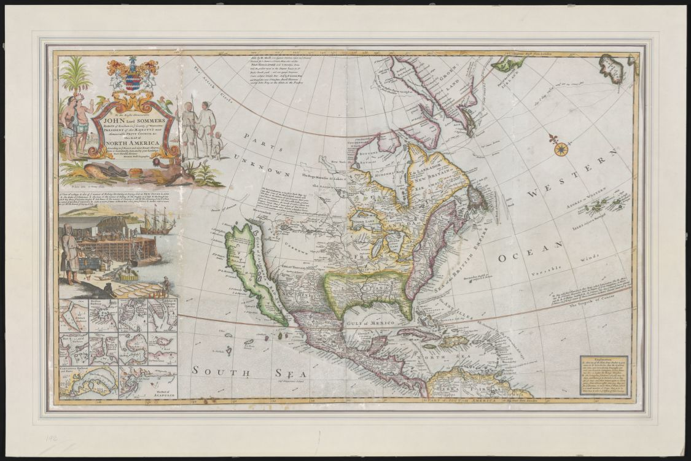

# Speculation and Cartographic Invention

---

* The Spanish abandoned exploration of the Pacific Northwest in the early seventeenth century as a decline in Spain’s power shifted attention to existing territories.
* There would not be another European attempt to explore the Pacific Northwest for the next 150 years.
* And yet, many maps were published during this period that show or suggest a Strait of Anian and a Northwest Passage.
* These maps may have reflected a combination of blind faith and speculation, but sometimes worked to entice sponsors for future expeditions. 

Below, several different European cartographic depictions of the Pacific Northwest in a period of no European exploration of the Pacific Northwest;

---

1625, Briggs, *The North part of America conteyning Newfoundland, New England, Virginia, Florida, New Spaine and Nova Francia, with ye riche Iles of Hispaniola, Cuba, Jamaica, and Porto Rieco, on the south, and upon ye west the large and goodly island of California*

[View on Searchworks.com](https://searchworks.stanford.edu/view/9917574) 

* Englishman Henry Briggs published this 1625 map based on Ascensión’s Spanish map that shows California as an Island. 
* Note description of the large bays in the northeast as “[a fair entrance to the nearest and most temperate passage to Japan and China],” where Briggs makes the case for the existence of a Northwest Passage above California.
* A framed cartouche drawn over the Pacific Northwest masks the fact that this region was still unknown.

---
This 1660 map from London shows another cartographer’s depiction of California as an Island but with the Strait of Anian much further north, resembling the Bering Strait, and the area in between labeled New Albion for England. The cartographer readily admits a lack of certainty about the strait. He comments, “[Farther towards the North America is yet unknown, yet there are many conjectures concerning the passing of the Straits of Anian and Davis].” 

1660, Walton, *A NEW, Plaine, and Exact Map of AMERICA: described by N:I: Visscher, and don into English, enlarged, and corrected, according to I: Blaeu, with the habits of the countries, and the manner of the cheife Citties: the like never before.*

[View on Searchworks.com](https://searchworks.stanford.edu/view/10625043)

---
This 1666 map (below) by Dutch cartographer Peter Goos depicts the Strait of Anian directly above California. A sailing ship appears headed toward the strait. When compared to the 1660 Walton map (above) it becomes clear that European cartographers were unsure about the location of the Strait, or whether it existed at all.

1666, Pieter Goos, *Paskaerte van NOVA GRANADA, en t'Eylandt CALIFORNIA*

[View on Searchworks.com](https://searchworks.stanford.edu/view/10624763)

---
A few years later (in 1677), a French map implies the possibility of a wide-open northwest passage between a Strait of Anian above California and Buttons Bay to the northeast. 

1677, Duval, *CARTE VNIVERSELLE du MONDE Avec de nouvelles Observations : AMERIQUE SEPTEMTRIONALE.* 

[View on Searchworks.com](https://searchworks.stanford.edu/view/10625060)

---

A German map from 1700 again shows the Strait of Anian above California but the cartographer conveniently hides any ideas about a connected Northwest Passage by placing a globe and podium over the region.

1700, Scherer, *IDEA NATVRALIS AMERICÆ BOREALIS DIGITO DEI FORMATA GEOGRAPHICE PROPOSITA AN MDCC.* 

[View on Searchworks.com](https://searchworks.stanford.edu/view/10624791)

---

In the same period, a French map shows a completely open passage between the Pacific and Atlantic Oceans via the Strait of Anian above California.

[1700], Mortier, *Carte generale du monde, ou description du monde terrestre & aquatique = Generale waereld kaart, of beschryving van de land en water waereld*

[View on Searchworks.com](https://searchworks.stanford.edu/view/9336599)

---

A British map published in 1719 shows the Strait of Anian but acknowledges “Parts Unknown” to the north.

1719, Moll, *North America* 

[View on Searchworks.com](https://searchworks.stanford.edu/view/10624823)

---

