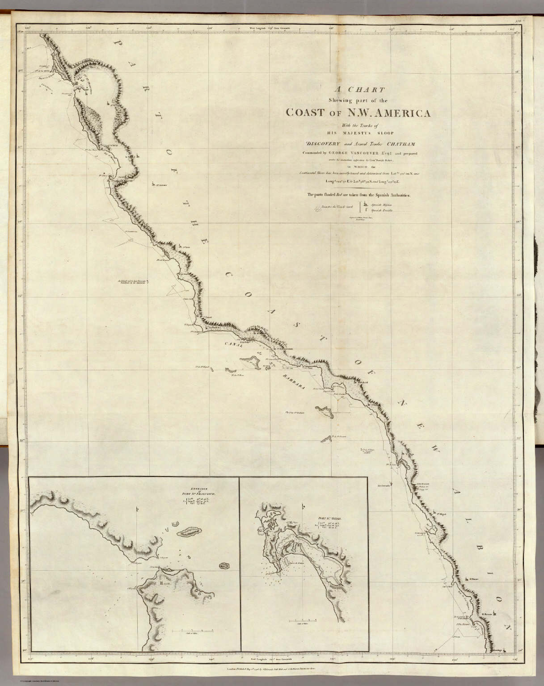
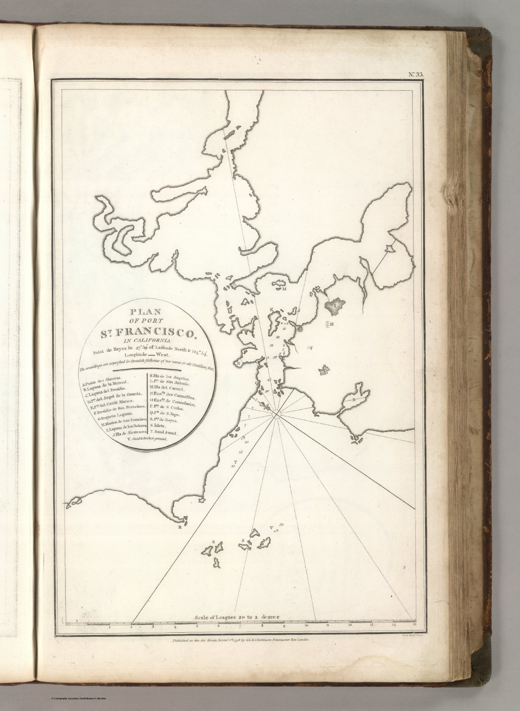

# The wild Pacific Coast 

---

* In the late 1700s, global resources and attention were focused on the American Revolution unfolding on the Atlantic Coast.    
* Misrepresentation of [California as an Island](https://exhibits.stanford.edu/california-as-an-island) lingered in some copies of copies of copies of European maps.  
* Though fully traversed by European expeditions, the coast was still poorly understood, with the [first map of the San Francisco Bay](https://searchworks.stanford.edu/view/10773850) only published by the Portola Expedition in 1770.
* Nearly 30 years then passed before Vancouver published his completed map of the northwest (at left below), which dispelled the idea of a passage connecting the Atlantic with the Pacific. 

|  |  |
| ----- | ----- |
| 1798, Vancouver, *"Voyage of discovery to the North Pacific Ocean and round the world; in which the coast of north-west America has been carefully examined and accurately surveyed ... Atlas." \[cartographic material\].*  | 1799, Jean-Francois de Galaup, comte de La Perouse, *“Plan of the Port of St. Francisco in California.”*  |
| [View in Searchworks](https://searchworks.stanford.edu/view/10453623) • [View on DavidRumsey.com](https://www.davidrumsey.com/luna/servlet/s/znr8uv)  | [View in Searchworks](https://searchworks.stanford.edu/view/10451027) • [View on DavidRumsey.com](https://www.davidrumsey.com/luna/servlet/s/wz2fov)  |
